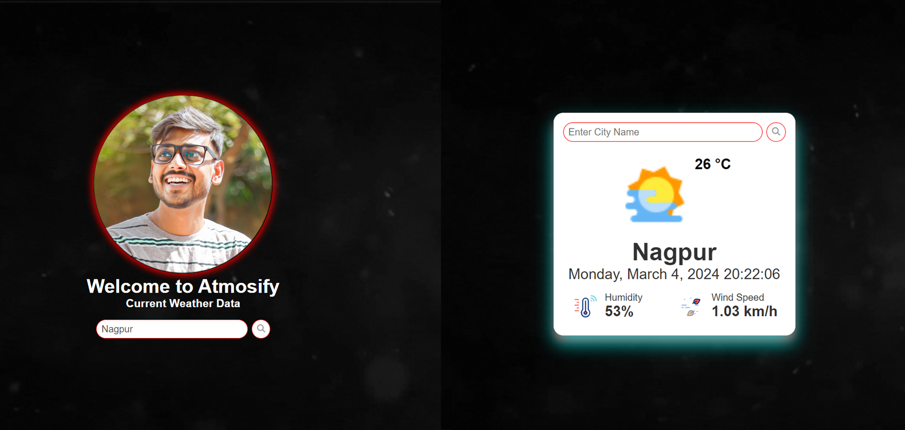

 

  <h3 align="center">Atmosify : Weather forecast</h3>

## About The Project

Atmosif is a weather details project designed to provide concise and real-time information about a given city's weather conditions. With a user-friendly interface, it delivers essential weather data, including temperature, humidity, and wind speed, ensuring users stay informed at a glance. Atmosif aims to enhance the weather-checking experience with simplicity and accuracy.

## Built With

Java(Servlets,Jsp),HTML and Css,JavaSript

## Getting Started

To get a local copy up and running follow these simple example steps.

### Prerequisites

You need tomcat server to run this project ,But don't worry i already provided necessary all files

## Usage

This projects gives weather condition according to their city names..

## Contributing

Contributions are what make the open source community such an amazing place to be learn, inspire, and create. Any contributions you make are **greatly appreciated**.
* If you have suggestions for adding or removing projects, feel free to [open an issue](https://github.com/kunal062001/Atmosify/issues/new) to discuss it, or directly create a pull request after you edit the *README.md* file with necessary changes.
* Please make sure you check your spelling and grammar.
* Create individual PR for each suggestion.
* Please also read through the [Code Of Conduct](https://github.com/kunal062001/Atmosify/blob/main/CODE_OF_CONDUCT.md) before posting your first idea as well.

## Authors

* **Kunal Sarode** - *Software Developer* - [Kunal Sarode](https://github.com/kunal062001/) - **

